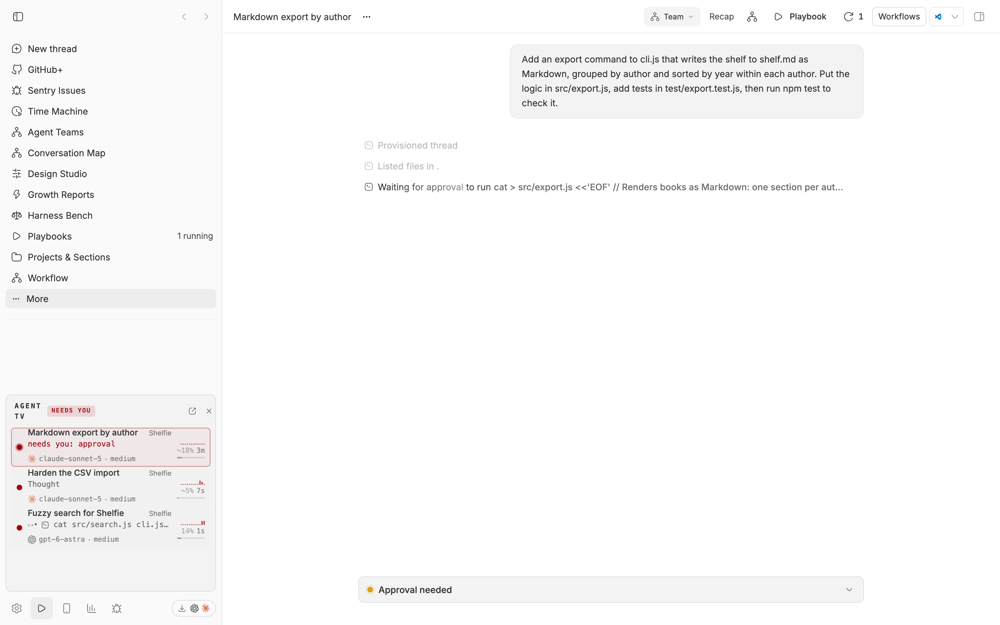
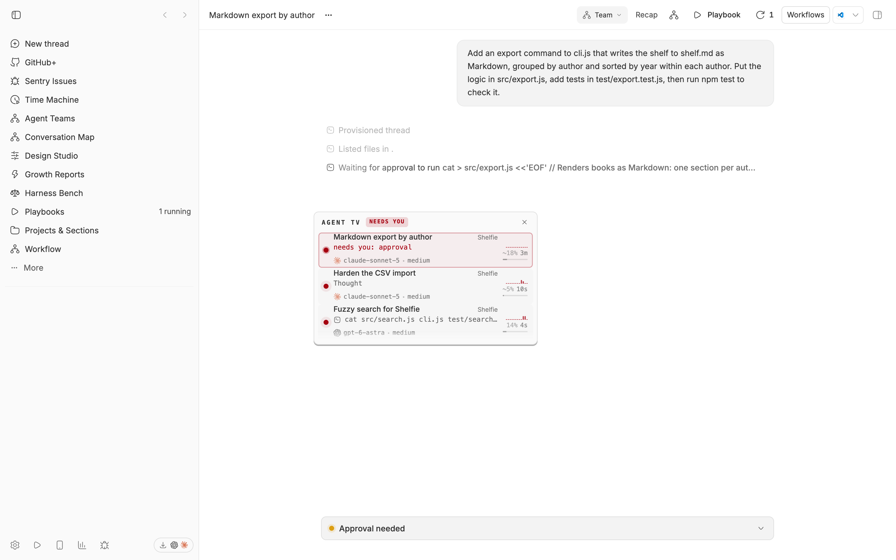
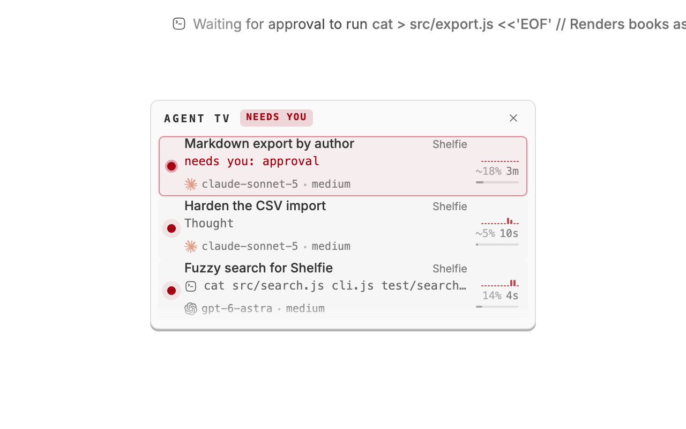
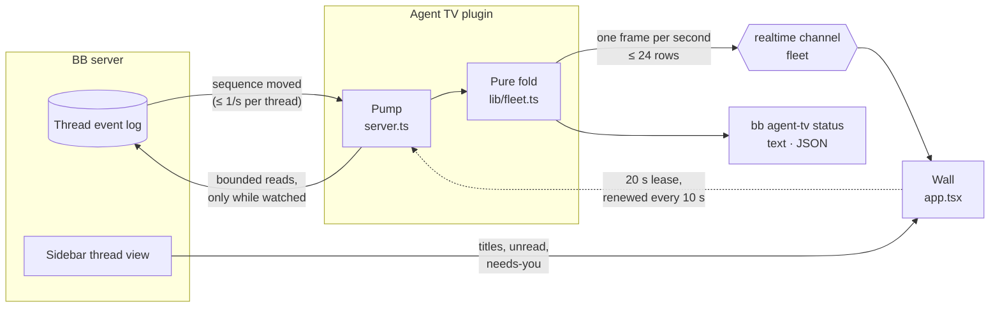

<div align="center">


# Agent TV

### See what every agent is doing, from anywhere in BB.

A live wall of your running threads, one hover away in the sidebar footer.<br>
Tool calls, files, activity, context left, and who is waiting on you, at a glance.


[Features](#features) · [Install](#install) · [How it works](#how-it-works) · [Privacy](#private-by-default) · [CLI](#cli) · [Settings](#settings) · [Development](#development)

<br>



</div>

<br>

> [!NOTE]
> The screenshots are real captures of demo threads working on a throwaway
> project. Unrelated threads were hidden.

## The problem

You have six threads running. One is committing, one is fighting a type error,
and one is waiting for an approval you did not know it needed.

BB's timeline tells you everything about one thread. To know what all of them
are doing, you have to open them one at a time.

**Agent TV puts every running thread on one wall** at the foot of the sidebar,
so you can see which one needs you without leaving the page you are on.

|  | Without Agent TV | With Agent TV |
| --- | :---: | :---: |
| See what every running thread is doing right now | ❌ | ✅ one tile each |
| Tell a working thread from a stalled one | ❌ | ✅ 60-second activity trace |
| Know which thread is close to compacting | ❌ | ✅ context runway |
| See what a blocked thread is asking for | ❌ | ✅ "needs you: approval" |
| Watch the fleet without leaving your page | ❌ | ✅ footer wall or pop-out |
| Let an agent see what its siblings are doing | ❌ | ✅ `bb agent-tv status` |

## Features

<table>
<tr>
<td width="50%" valign="top">

### 📺 One wall, every thread

Each running thread gets a tile: the tool call in flight in BB's own words and
icon, the files it touched in the last minute, and a typing indicator while the
model streams.

</td>
<td width="50%" valign="top">

### 🙋 Needs you, first

A thread blocked on a question or an approval is outlined, labelled with what it
is asking, and sorted to the top of the wall and of the CLI.

</td>
</tr>
<tr>
<td valign="top">

### ⛽ Context runway

A rail along each tile shows how much of its context window the thread has
spent, flagged at 80%. Providers that do not report usage show no rail rather
than an empty one.

</td>
<td valign="top">

### 📈 Activity you can compare

A 60-second sparkline on an absolute scale, so a flat line is a stalled agent
and two tiles compare at a glance. Streaming counts once per bucket, not once
per token.

</td>
</tr>
<tr>
<td valign="top">

### 🪟 Pop-out monitor

Detach the wall into a monitor you can drag anywhere in BB, or move with the
arrow keys. It remembers where you left it.

</td>
<td valign="top">

### 🤖 The same feed for agents

`bb agent-tv status` prints the wall as text or JSON, so an orchestrating agent
can see which of its siblings is stuck, and a bundled skill tells it how.

</td>
</tr>
</table>

<div align="center">
<table>
<tr>
<td align="center"><br><sub><b>Pop it out over any thread</b></sub></td>
<td align="center"><br><sub><b>Every tile, up close</b></sub></td>
</tr>
</table>
</div>

## Install

```sh
bb plugin install git:https://github.com/MacHatter1/bb-plugin-agent-tv --yes
```

That's it. The **Agent TV** row appears in the sidebar footer, and nothing is
read until you open it.

<details>
<summary><b>Install from a local clone</b></summary>

```sh
git clone https://github.com/MacHatter1/bb-plugin-agent-tv
cd bb-plugin-agent-tv
npm install && bb plugin build
bb plugin install path:$PWD --yes
```

</details>

**Requirements**

- bb **0.43+** (Plugin SDK 0.5.9+)
- Nothing else: no account, API key or network access.

## Where to find it

| Where | What |
| --- | --- |
| **Agent TV row** in the sidebar footer | Hover to peek at the wall, click to keep it open. Click a tile to open its thread. <kbd>Esc</kbd> closes it. |
| **Fleet count** in the wall's header | Shows how many threads are working and waiting. Click it to show only live threads. |
| **Pop-out button** in the wall's header | Detaches the wall into a monitor. Drag its header, or focus it and use the arrow keys (<kbd>Shift</kbd> for bigger steps). |
| **Check mark** on a quiet tile | Dismisses the tile until its thread gets busy again. Remembered across reloads. |
| **`bb agent-tv status`** | The same feed in a terminal, or for an agent. |

<details>
<summary><b>What each piece of a tile means</b></summary>

| Piece | Where it comes from |
| --- | --- |
| On-air light | The thread's lifecycle status **and** evidence of work, because BB leaves a thread `active` for hours after it stops |
| Action line | The newest `item/started` / `item/completed` event, with BB's own verb (`presentation.label`), text and icon |
| Typing indicator | Any `item/*/delta` or `*/progress` event in the last 3 s |
| File chips | Paths written by `fileChange` items in the last 60 s, newest first |
| Sparkline | 12 × 5 s buckets of event counts on an absolute log scale |
| Context runway | The share of the context window spent, flagged at 80% or more; hidden when a provider does not report usage |
| Needs you | The sidebar's own `hasPendingInteraction`, naming the ask (`question`, `approval`, `permission`) |
| Agent mark | The provider's BB logo, with its name available to assistive technology |
| Model · effort | The model and reasoning effort selected for the latest turn, including any provider fallback |
| Project | The project name, for project-backed threads |
| Family badges | Parent/child links, including subagents the sidebar hides |

</details>

## How it works



- **BB's own events.** Tiles are folded from the durable thread event log, not
  scraped from provider output, so Codex, Claude Code, Pi and Cursor threads
  all read the same way.
- **Reads only while you watch.** An open wall renews a 20-second lease. Close
  it and the pump stops reading. The CLI reads only when you run it.
- **Holds still.** Each thread keeps the slot it was given when it first
  appeared, and every tile is a fixed height, so the wall never reshuffles or
  loses your scroll position while it is open.
- **Bounded.** A frame carries at most 24 rows, 6 files and 12 heat buckets,
  and an unchanged frame is not republished.

<details>
<summary><b>The full read budget</b></summary>

- The wall reads nothing until it is open. An open wall renews a 20-second
  lease every 10 seconds, and when you close it the pump goes quiet by itself.
- Each coalesced notification costs at most a few bounded reads (`limit` 60, 3
  rounds), and each thread is read at most once at a time.
- Event reads carry an allowlist of only the lifecycle, model, item and delta
  kinds Agent TV folds, so unrelated timeline payloads never cross the plugin
  boundary.
- A feed further behind than one pass can retire takes the tail instead of
  following the log forward. A streaming thread appends faster than any bounded
  reader can keep up, and a feed replaying history makes a live thread look
  settled and quiet, which is worse than a gap.
- If a page hits BB's response-size ceiling, that feed halves its page size and
  retries from the same cursor. An event too large to fetch even on its own is
  stepped over, because a cursor that cannot move leaves a feed that never
  updates again.
- A read that fails backs off exponentially and gives up after five tries. If
  BB reports a thread as deleted, the pump drops it rather than asking again.
- The clock is left out of the change check, because `t` and `quietMs` move on
  their own, and the wall ages its own rows between frames.

</details>

## Private by default

- 🙈 **Masks credentials.** Inline `NAME=value` secrets, `Authorization:`
  headers, `-u user:pass`, `--password`/`--token` values, `user:pass@` URLs and
  recognisable key prefixes are replaced with `•••` where the action line is
  built, so the wall, the CLI and the realtime channel all get the same masked
  text.
- 🔒 **Scoped for agents.** Run inside a thread, `bb agent-tv status` shows only
  that thread's project. Widening it takes an explicit `--all-projects`.
- 👻 **Keeps hidden threads hidden.** Threads BB marks as hidden never get a row
  of their own; they are counted in their parent's family badge instead.
- 🏠 **Stays on your machine.** No account, no external service and no network
  access.

## CLI

```sh
bb agent-tv status                # human-readable fleet feed
bb agent-tv status --json         # the exact frame the wall renders
bb agent-tv status --limit 3      # the busiest threads only
bb agent-tv status --all-projects # every project, not just the caller's
```

<details>
<summary><b>Sample output</b></summary>

```text
AGENT TV — 2 of 3 threads on air · 1 waiting on you
  ! Markdown export by author [active] thr_gwzef8dd4k
    NEEDS YOU: approval  45s ago  ▄▄▁▁▁▁▁▁▁▁▁▁  ctx ~18%
  ● Harden the CSV import [active] thr_ynsk4gqp6b
    Running command: npm test  2s ago  ▁▂▃▅▆▇▆▅▇██▇  ctx ~5%
    files: import.js, import.test.js
  ● Fuzzy search for Shelfie [active] thr_ksw9nh9qv5
    typing…  now  ▂▃▃▄▅▅▆▆▇▇▇█  ctx 14%
```

</details>

**Agents:** the bundled [skill](skills/agent-tv/SKILL.md) describes the `--json`
frame and how to read it: lead with `waiting`, trust `busy` over `status`, and
treat a `null` context as unknown rather than plentiful.

## Settings

`bb plugin config agent-tv`, or **Settings → Installed plugins → Agent TV**.

<details>
<summary><b>All settings</b></summary>

| Setting | Default | |
| --- | --- | --- |
| `maxRows` | `8` | How many threads the feed carries (1–24). The wall shows four and scrolls for the rest. |
| `showQuiet` | `true` | Keep threads whose turn has ended. Turn it off for a wall of only what is running. |
| `peekOnHover` | `true` | Open the wall when the pointer rests on its footer row. |

Every setting applies live, with no reload.

</details>

<details>
<summary><b>Turning it off</b></summary>

```sh
bb plugin disable agent-tv
bb plugin enable agent-tv
```

`bb plugin remove agent-tv` removes the plugin and its settings.

</details>

## Development

```sh
npm install
npm test                           # Vitest: the fold, the peek state machine, the pump, the wall
npm run typecheck                  # tsc --noEmit, strict
bb plugin build                    # dist/server.js, dist/app.js, dist/app.css
bb plugin install path:$PWD --yes
bb plugin dev                      # rebuild and reload on every save
```

```
server.ts        fleet pump, realtime frame, `bb agent-tv` CLI
app.tsx          footer disclosure, tiles, hover peek, pop-out monitor
lib/fleet.ts     pure event fold, heat buckets, frame budget, Zod wire schemas
lib/peek.ts      hover-to-peek / click-to-keep state machine
lib/popout.ts    keeps the detached monitor's header on screen
components/ui/   vendored BB icon components (the shadcn model)
skills/          the bundled agent skill
docs/            logo and screenshots
```

**Tests** run the pump against the official fake plugin host
(`@get-bb/plugin-sdk/testing`) and render the real disclosure with
`renderSlot`. They check, among other things, that no thread events are read
while nobody is watching and that a malformed realtime frame cannot blank the
wall. A guard test fails the build if anything imports BB internals rather than
the public Plugin SDK.

`PLUGIN_OVERVIEW.md` is the store listing. Keep it in step with
`bb.description` in `package.json`. See [CONTRIBUTING.md](CONTRIBUTING.md) for
the release checklist.

## Licence

[MIT](LICENSE)
